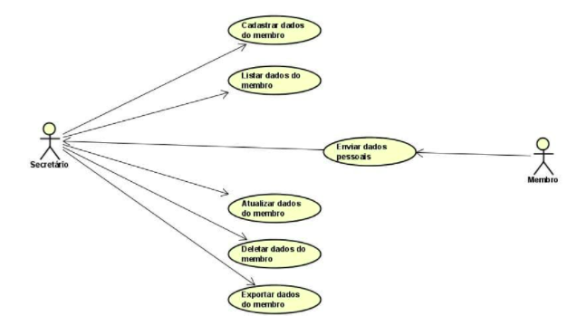

# Especificações do Projeto

## Personas

As personas estabelecidas durante o processo de entendimento do problema são apresentadas abaixo:

|Secretário        |                                                                                                                       |
|------------------|-----------------------------------------------------------------------------------------------------------------------|
|Idade:            | 31                                                                                                                    |
|Ocupação:         | Secretário                                                                                                            |
|Escolaridade:     | Superior completo                                                                                                     |
|Responsabilidades:| Cadastro e controle de membros da igreja                                                                              |
|Problemas:        | Controlar o cadastro dos membros da igreja através de papéis   Dificuldade de manuseamento dos dados cadastrados|
|Ambiente:         | Escritório da igreja                                                                                                  |
|Hobbies:          | Viajar com os amigos   Tocar violão                                                                              | 
|Estilo de vida:   | Saudável                                                                                                              | 
|Hábitos:          | Acordar cedo   Pedalar pela manhã                                                                                | 

|Secretário Geral  |                                                                                                                       |
|------------------|-----------------------------------------------------------------------------------------------------------------------|
|Idade:            | 40                                                                                                                    |
|Ocupação:         | Secretário geral                                                                                                      |
|Escolaridade:     | Superior completo                                                                                                     |
|Responsabilidades:| Revisar membros cadastrados  Gerar relatórios de cadastro                                                        |
|Problemas:        | Falta de controle administrativo dos membros                                                                          |
|Ambiente:         | Escritório da igreja                                                                                                  | 
|Hobbies:          | Cozinhar   Estudar sobre investimentos                                                                           | 
|Estilo de vida:   | Minimalista                                                                                                           | 
|Hábitos:          | Passear com a família   Ler no mínimo dois livros por mês                                                        | 

## Histórias de Usuários

A partir dos interesses e do dia a dia das personas utilizadas para o projeto, foram registradas as seguintes histórias de usuário:

|EU COMO... `PERSONA`| QUERO/PRECISO ... `FUNCIONALIDADE` |PARA ... `MOTIVO/VALOR`                 |
|--------------------|------------------------------------|----------------------------------------|
|Secretário        |cadastro eletrônico dos membros em vez de papéis | ter maior facilidade no cadastro dos membros|
|Secretário Geral        |ter mais controle sobre as atividades dos membros| promover melhorias para os frequentadores da igreja|
|Secretário Geral        |ter um acesso facilitado aos dados administrativos da igreja| ter uma melhor gestão administrativa|

## Requisitos

Nesta parte serão listados os requisitos funcionais e não funcionais, onde os funcionais descrevem a interação dos usuários com o sistema, e os não funcionais descrevem as funcionalidades do sistema de uma forma geral.

### Requisitos Funcionais

A tabela a seguir apresenta os requisitos do projeto, identificando a prioridade em que os mesmos devem ser entregues.

|  ID      | Descrição do Requisito  | Prioridade |
|----------|-----------------------------------------|----|
|RF-001    | O sistema deve ser capaz de cadastrar os dados dos membros da igreja | ALTA |
|RF-002    | O sistema deve ser capaz de listar os dados dos membros da igreja | ALTA |
|RF-003    | O sistema deve ser capaz de atualizar os dados dos membros da igreja | ALTA|
|RF-004    | O sistema deve ser capaz de deletar os dados dos membros da igreja | ALTA |
|RF-005    | O sistema deve ser capaz exportar os dados em PDF | MÉDIA |

### Requisitos não Funcionais

A tabela a seguir apresenta os requisitos não funcionais que o projeto deverá atender.

|ID       | Descrição do Requisito  |Prioridade |
|-------  |-------------------------|----|
|RNF-001| O sistema deve ser publicado em um ambiente acessível ao usuário exclusivo do sistema (Vercel/Azure) | ALTA | 
|RNF-002| O sistema deverá ser responsivo permitindo a visualização em um celular de forma adequada | ALTA | 
|RNF-003| O sistema deve ter bom nível de contraste entre os elementos da tela em conformidade | MÉDIA | 
|RNF-004| O sistema deve ser compatível com os principais navegadores do mercado (Google Chrome, Firefox, Microsoft Edge, Safari) | ALTA | 

## Restrições

As questões que limitam a execução desse projeto e que se configuram como obrigações claras para o desenvolvimento do projeto em questão são apresentadas na tabela a seguir.

|ID| Restrição                                             |
|--|-------------------------------------------------------|
|01| O projeto deverá ser entregue no final do segundo semestre, não podendo extrapolar a data de 26/06/2022. |
|02| O sistema deve conter um back-end estruturado de acordo com a programação modular. |
|03| A manipulação dos dados do sistema deve ser realizada através da linguagem de banco de dados SQL e armazenadas no SQL Server. |
|04| A equipe não poderá adicionar nem retirar os integrantes durante todo o processo de desenvolvimento do projeto. |

## Diagrama de Casos de Uso

O diagrama de casos de uso é o próximo passo após a elicitação de requisitos, que utiliza um modelo gráfico e uma tabela com as descrições sucintas dos casos de uso e dos atores. Ele contempla a fronteira do sistema e o detalhamento dos requisitos funcionais com a indicação dos atores, casos de uso e seus relacionamentos. 

