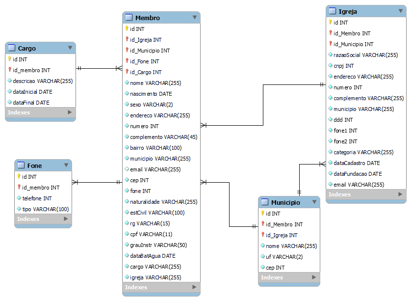
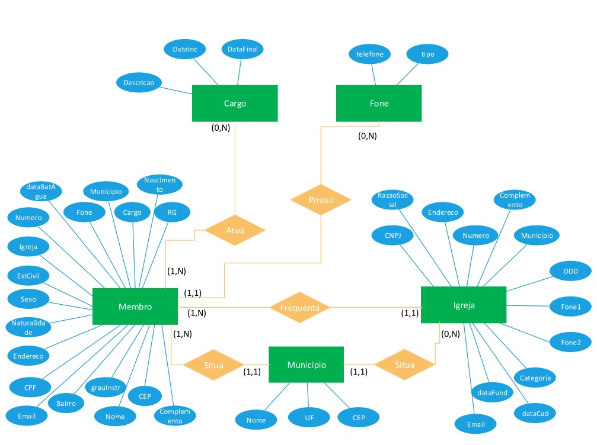

# Arquitetura da Solução

## Diagrama de Classes

O diagrama de classes ilustra graficamente como será a estrutura do software, e como cada uma das classes da sua estrutura estarão interligadas. Essas classes servem de modelo para materializar os objetos que executarão na memória.

## Modelo ER 

No Modelo ER define-se o relacionamento e as dependências das entidades que compõem o sistema. Nessa modelagem são informadas as chaves primárias e chaves estrangeiras.

## Diagrama Esquema Relacional

O Diagrama ER ilustra como as entidades se relacionam entre sim, atraves de suas cardinalidades. Além de informar os atributos de cada entidade. 

## Tecnologias Utilizadas

Descreva aqui qual(is) tecnologias você vai usar para resolver o seu problema, ou seja, implementar a sua solução. Liste todas as tecnologias envolvidas, linguagens a serem utilizadas, serviços web, frameworks, bibliotecas, IDEs de desenvolvimento, e ferramentas.

Apresente também uma figura explicando como as tecnologias estão relacionadas ou como uma interação do usuário com o sistema vai ser conduzida, por onde ela passa até retornar uma resposta ao usuário.

## Hospedagem

