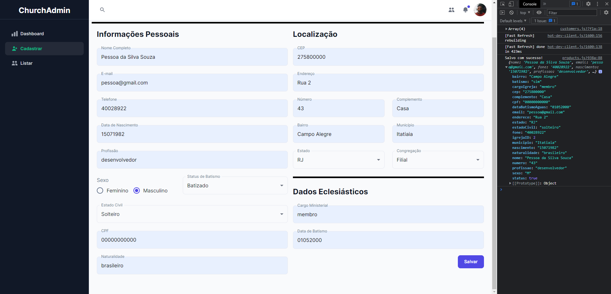
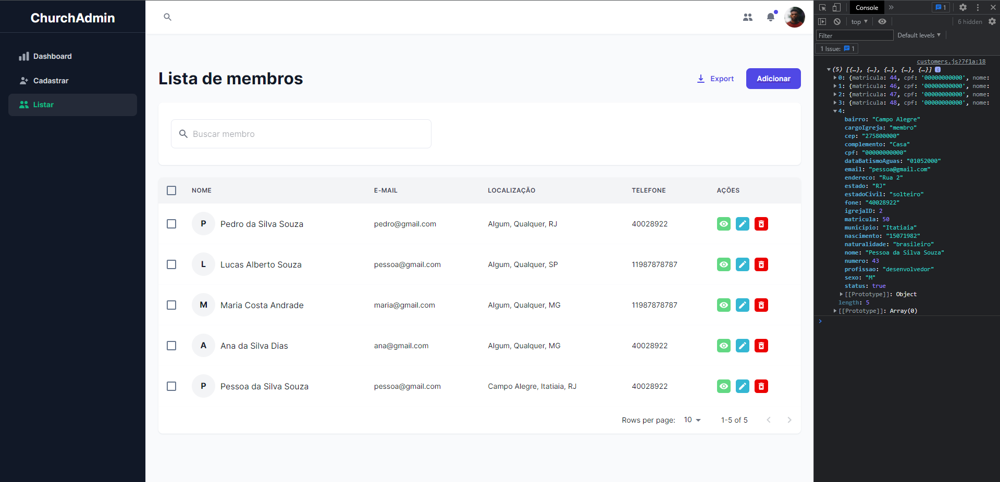
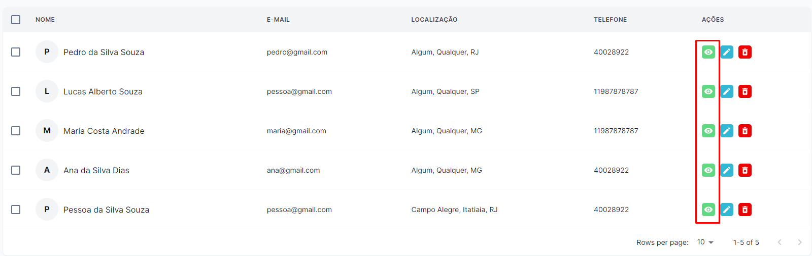
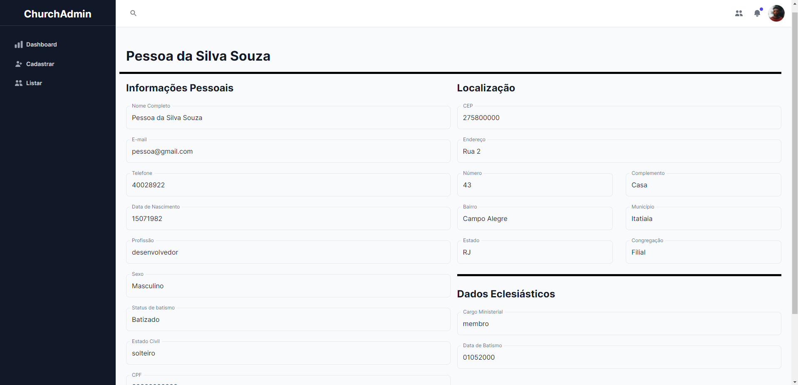
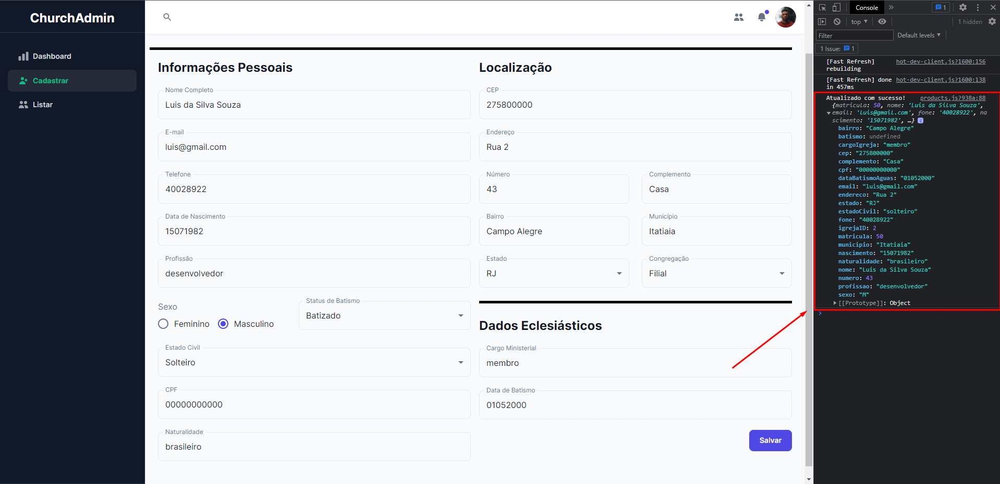
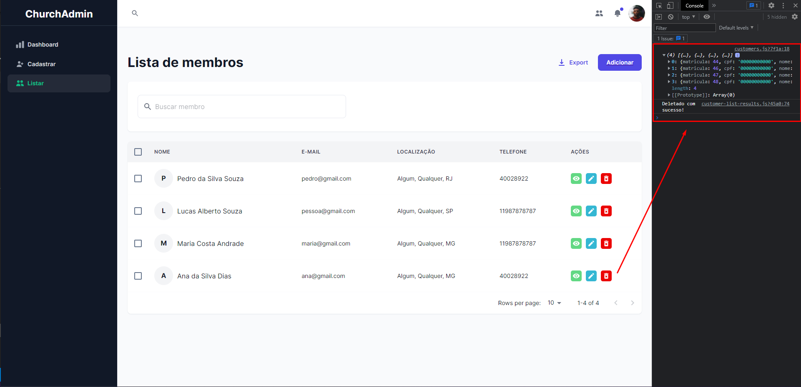
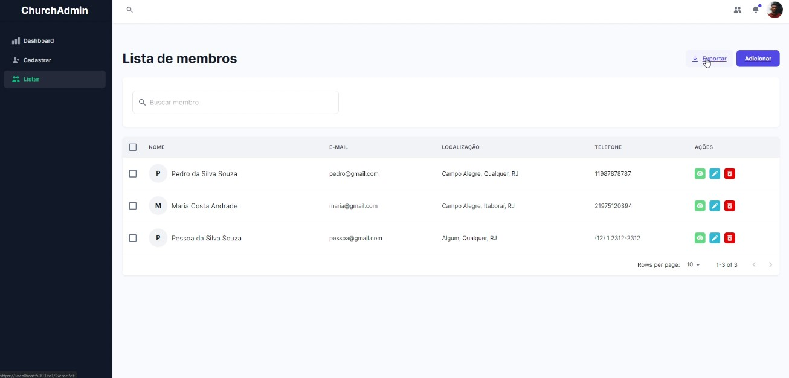
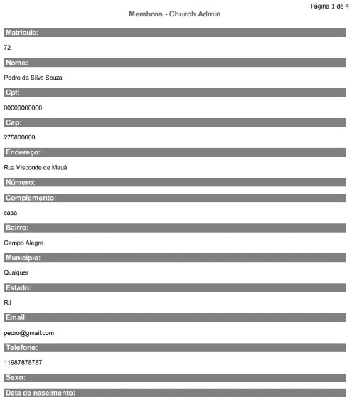

# Registro de Testes de Software

Tabela de resumo com os resultados dos testes.

|  Caso de teste | Descrição  | Resultado |
| :------------: | :------------ |:------------: |
| CT-01 |  Cadastramento de membros  | Sucesso|
| CT-02 |  Consulta de membros | Sucesso|
| CT-03 |  Funcionalidade do botão de visualizar | Sucesso|
| CT-04 |  Informações detalhadas  | Sucesso|
| CT-05 |  Funcionalidade de atualizar cadastro  | Sucesso|
| CT-06 |  Funcionalidade do botão de deletar cadastros  | Sucesso|
| CT-07 |  Exportar informações de cadastro  | Sucesso|

## CT-01- Cadastramento de membros

Conforme o CT-01, o teste foi executado com sucesso. Todas os campos preecnhidos e enviados, são armazenados e dado como salvo com sucesso.

## CT-02- Consulta de membros

Conforme o CT-02, o teste foi executado com sucesso. Ao digitar a matricula ou CPF do membro cadastrado, o resultado é exibido.

## CT-03- Funcionalidade do botão de visualizar

Conforme o CT-03, o teste foi executado com sucesso. O botão de vizualizar foi incluído e ao clicar, a página de informções detalhadas é exibida. 

## CT-04- Informações detalhadas

Conforme o CT-04, o teste foi executado com sucesso. É possível através da página de listar cadastros, clicar no botão de vizualizar e exibir todas as informações de cadastro do membro preenchidas. 

## CT-05- Funcionalidade de atualizar cadastro

Conforme o CT-05, o teste foi executado com sucesso. Ao alterar algum campo na área de cadastro e clicar em salvar, a mensagem de atualizado com sucesso é exibida, e as informações atualizadas. 

## CT-06- Funcionalidade do botão de deletar cadastros

Conforme o CT-06, o teste foi executado com sucesso. O botão de deletar foi incluído e ao clicar, a memsagem de usuario deletado é exibida. 

## CT-07- Exportar informações de cadastro

Conforme o CT-07, o  teste foi executado com sucesso. Ao clicar no botão de exportar, o usuário consegue exportar as informações em um arquivo PDF. 

Arquivo gerado em PDF, com as informações dos membros.

## Avaliação

Todos os testes foram executados com sucesso conforme o plano de teste proposto. Tanto o front-end, quando o back-end tiveram uma boa integração para que os resultados fossem alcançados. Conseguimos incluir a funcionalidade de exportar um arquivo em PDF com as informações de cadastro, conforme proposto inicialmente. 