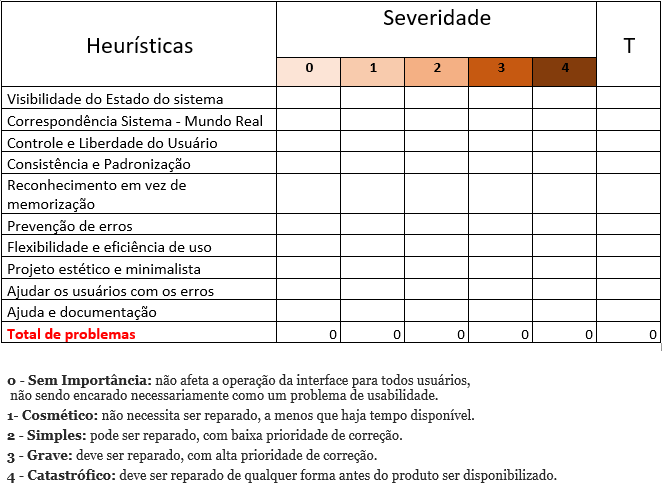

# Plano de Testes de Usabilidade
## Avaliação Dinâmica (feita pelo usuário que faz as transações - casos de uso)

> - Objetivo do teste: Avaliar a usabilidade do software  

> - Quando e onde o teste será executado: Online 

> - Tempo de duração para cada sessão de teste: 20 minutos 

> - Estado em que o software deve estar no início do teste: Fase de protótipo (em construção) 

> - Usuários envolvidos no teste: Pastores e secretários de igrejas 

 
> - Tarefas definidas para que os usuários executem 

### Realizar os procedimentos das seguintes funcionalidades:  

1)  *Cadastrar Membro* : Realizar o preenchimento dos campos de *Informações Pessoais* e de *Localidade* da página de cadastro. Após preenchimento de todos os campos requeridos, o usuário     irá clicar no botão SALVAR.  

2)  *Cosultar membro* : Escolher o parâmetro a ser filtrado, digitar o dado a ser buscado, e clicar em consultar.  
    Após visualização dos dados, clicar no botão de consultar.

3)  *Deletar Membro* : Escolher o parâmetro a ser filtrado, digitar o dado a ser buscado, e clicar em deletar.  
    Após visualização dos dados, clicar no botão deletar e confirmar pergunta do pop-up, clicando novamente em um botão para a confirmação da ação de exclusão. 

4)  *Atualizar Membro* : Escolher o parâmetro a ser filtrado, digitar o dado a ser buscado, e clicar em editar.  
    Após visualização dos dados, clicar no botão atualizar e confirmar pergunta do pop-up, clicando novamente em um botão para a confirmação da ação de atualização.  

5)  *Exportar dados* : Clicar no botão exportar, após fazer o passo 4 para selecionar os dados. Visualize o arquivo de retorno. 

### Quais são as funcionalidades mais críticas: 

Deletar Pessoa: Mensagem de confirmação anteriormente à exclusão. 

 

## Dados que serão coletados durante os testes: 

Serão avaliados por nota, segundo as seguintes métricas: 

Nota 1-  Péssimo (refazer funcionalidade) 

Nota 2-  Ruim (refazer uma parte da funcionalidade) 

Nota 3-  Mediano (alterações pontuais) 

Nota 4-  Muito bom (experimentar e iterar) 

Nota 5-  Excelente (pronto para testar em produção) 

&nbsp;

## Avaliação Estática (Heuríticas de Nielsen)

Teste de Usabilidade (Heurísticas)

De uma forma geral, a heurística tem como objetivo reduzir a carga cognitiva do usuário, diminuindo o tempo de tomada de decisão fazendo com que as experiências sejam mais apropriadas e menos cansativas.

**1- Visibilidade do status do sistema**

Manter o usuário informado sobre o que acontece no momento da interação, podendo mostrar por exemplo quantos itens restam para completar o cadastro.

**2-Correspondência entre o sistema e o mundo real**

O reconhecimento de objetos e ícones que são familiares é muito importante para experiência do usuário, que fale a linguagem mais próxima de sua realidade, ícones como o símbolo de telefone ou uma carta que representa o e-mail.

**3-Liberdade e controle do usuário**

Considerando que o usuário pode tomar uma ação errada ou se arrepender da decisão que tomou, o sistema pode lhe dar a opção de voltar ou mesmo mostrar um aviso sobre à ação que será feita.

**4-Consistência e padrões**

Manter uma mesma linguagem durante toda a interface para não confundir o usuário, portanto, durante a interação, os usuários não devem ter dúvidas sobre o significado das palavras, ícones ou símbolos utilizados, é fundamental que uma interface mantenha padrões de interação em diversos contextos.

**5-Prevenção de erros**

Para prevenirmos que o usuário não se frustre ao ter os arquivos deletados, é importante criar uma mensagem de aviso da ação, para que haja a confirmação ou não da decisão.

**6- Reconhecer ao invés de lembrar**

O usuário não deve ter que se lembrar de todas as ações ou funções da interface é importante sempre deixar à disposição pequenos lembretes das informações que podem ser úteis a ele, como um símbolo de interrogação e ao clicar irá mostrar alguma informação.

**7-Flexibilidade e eficiência**

A interface desenvolvida precisa ser útil e atender tanto aos usuários inexperientes quanto aos experiêntes.

**8-Estética e Design minimalista**

A interface deve conter diálogos que contenham somente informações relevantes. Ou seja, evitar o uso desnecessário de elementos visuais que possam confundir o usuário.

**9-Auxiliar usuários a reconhecer, diagnosticar e recuperar erros**

É muito importante ajudar o usuário a identificar e encontrar soluções para os problemas e erros encontrados durante a interação. As mensagens de erro devem ser mostradas em uma linguagem simples, sem códigos, clara e que indique precisamente o problema e sugira uma solução.

**10- Ajuda e documentação**

Pode ser necessário fornecer documentação para ajudar os usuários a entender como concluir suas tarefas. O conteúdo de ajuda e documentação deve ser fácil de pesquisar e focado na tarefa do usuário.

Abaixo a tabela mostra como realizar um teste de usabilidade atrvés de pontuação.

